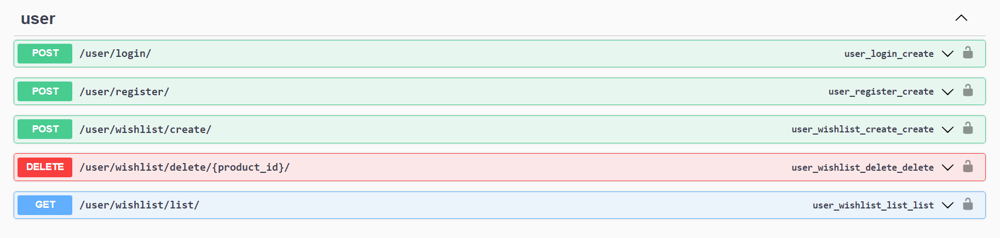
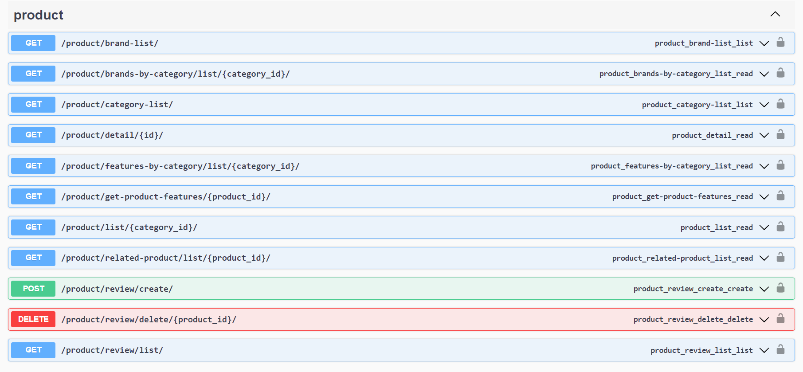
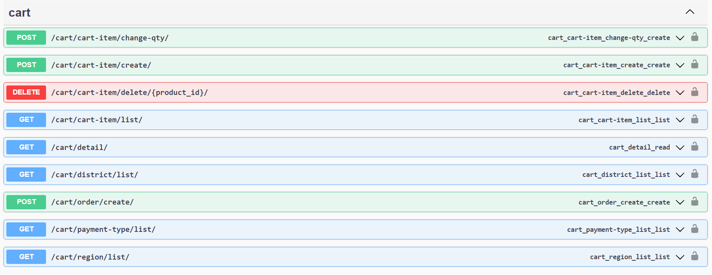

# Backend API for Online Store app!

### Tech & Tools
 
 

### Functional

- User registration and login 
- Able to add products to the user's wishlist
- Able to add products to the user's cart
- The ability to filter products
- Leave a review for the product
- Create a order

### Database schema

### API images
#### User app

#### Product app

#### Cart app
